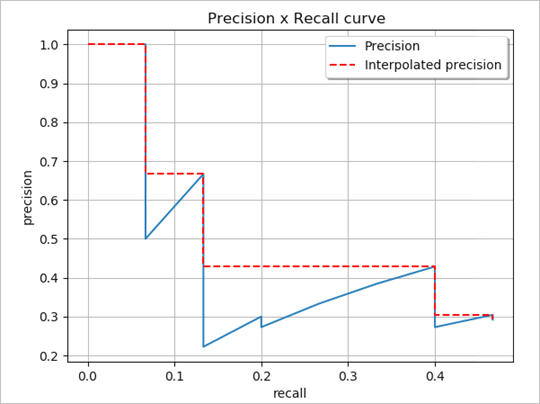

https://pro.arcgis.com/en/pro-app/latest/tool-reference/image-analyst/how-compute-accuracy-for-object-detection-works.htm

# Precision  
Precision is the ratio of the number of true positives to the total number of positive predictions. For example, if the model detected 100 trees, and 90 were correct, the precision is 90 percent.  
```
Precision = (True Positive)/(True Positive + False Positive)  
```

# Recall  
Recall is the ratio of the number of true positives to the total number of actual (relevant) objects. For example, if the model correctly detects 75 trees in an image, and there are actually 100 trees in the image, the recall is 75 percent.  
```
Recall = (True Positive)/(True Positive + False Negative)
```

# F1 score  
The F1 score is a weighted average of the precision and recall. Values range from 0 to 1, where 1 means highest accuracy.  
```
F1 score = (Precision × Recall)/[(Precision + Recall)/2]
```

# Precision-recall curve  
This is a plot of precision (y-axis) and recall (x-axis), and it serves as an evaluation of the performance of an object detection model. The model is considered a good predictive model if the precision stays high as the recall increases.



Average Precision—Average Precision (AP) is the precision averages across all recall values between 0 and 1 at various IoU thresholds. By interpolating across all points, AP can be interpreted as the area under the curve of the precision-recall curve.  

Mean Average Precision—The Mean Average Precision (mAP) is the average AP over multiple IoU thresholds. For example, mAP@[0.5:0.05:0.95] corresponds to the AP for IoU ratio values ranging from 0.5 to 0.95, at intervals of 0.05, averaged over all classes.